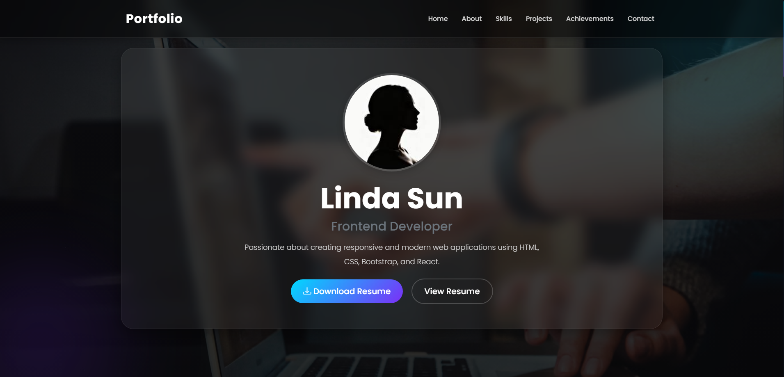
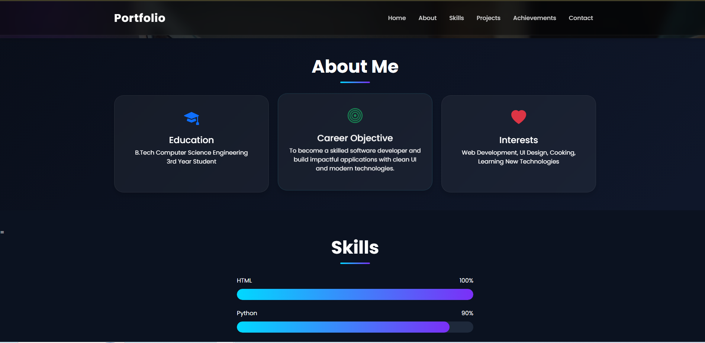
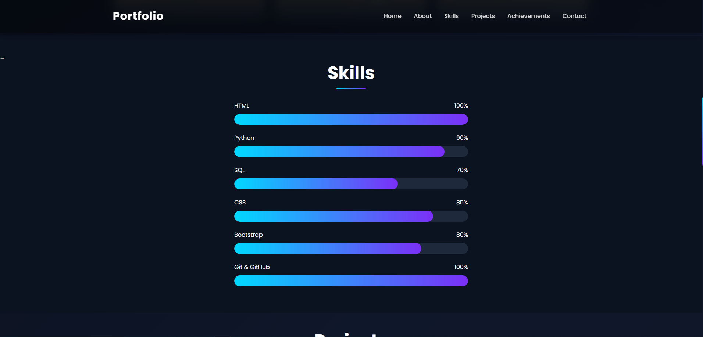
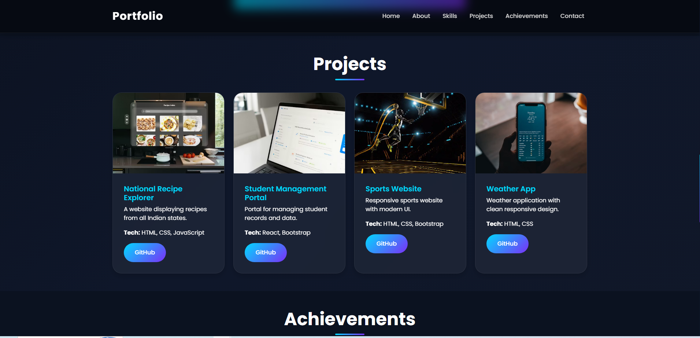
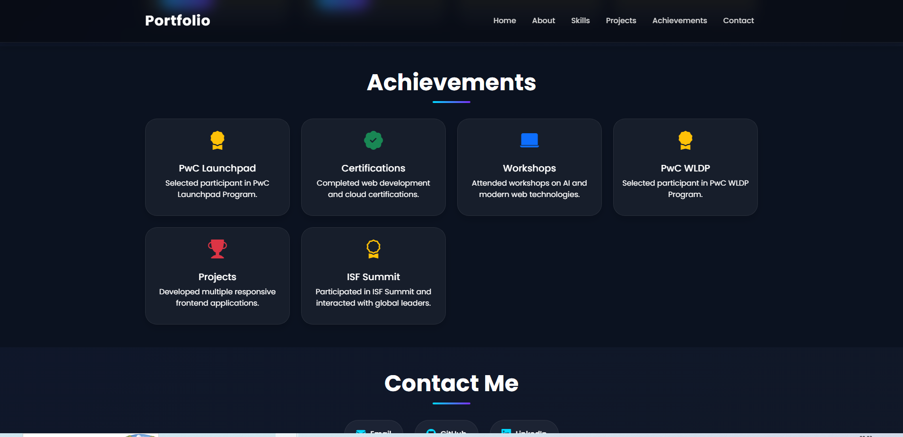
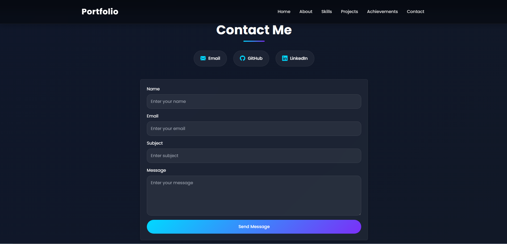
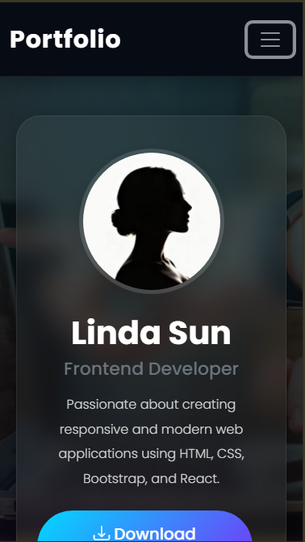
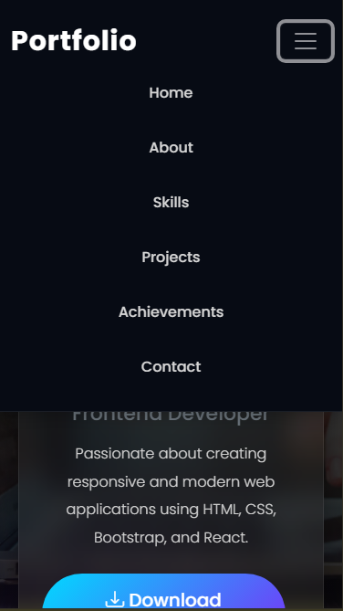

# Portfolio Website

A professional personal portfolio website built with HTML, CSS, and Bootstrap.

## Overview

This portfolio showcases:
- Profile information and resume download
- About section with education, career objective, and interests
- Skills displayed with progress bars and skill cards
- Four project summaries with technology stacks and GitHub links
- Achievements including certifications, workshops, internships, and awards
- A contact form and a resume summary modal

## Screenshots
## Home Page
 
## About Page
 
## Skills Page
 
## Projects Page
 
## Achievements Page
 
##  Contact Page

## Mobile View
 
 
 

## Built With

- HTML
- CSS
- Bootstrap 5
- Bootstrap Icons

## Git Repository Link
https://github.com/deekshitha-1701/Portfolio
